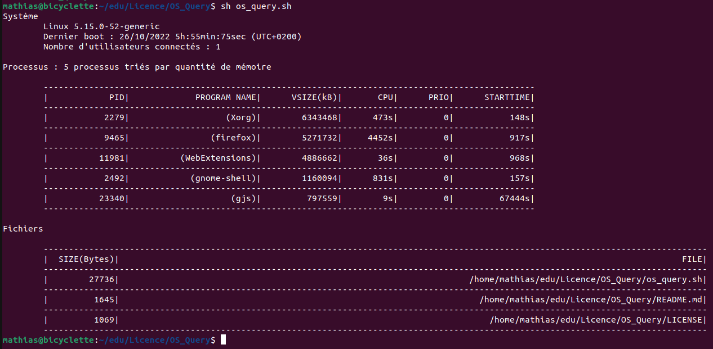
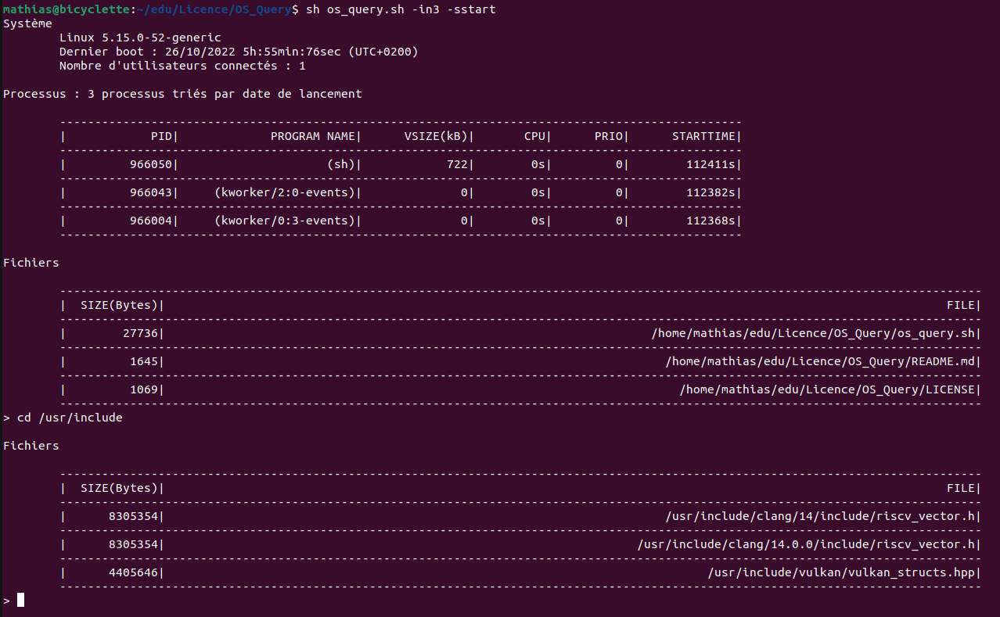

# OS_Query
Script shell POSIX permettant :
- L'affichage des informations système de base (Version de l'OS, date de dernier boot, nombre d'utilisateurs connectés)
- L'affichage de N processus triés selon un critère (mémoire réservée, temps processeur, prorité, date de lancement)
- L'affichage de N fichiers réguliers occupant le plus d'espace disque à partir d'un répertoir choisit par l'utilisateur
- L'envoie de signaux à des processus
- La modification de la valeur de priorité d'un processus

## Utilisation

### Mode non interactif
```
sh os_query.sh
```
<br>

<br>
### Mode interactif
-i pour lancer ce mode
```
sh os_query.sh -i
```
-in7 pour lancer le mode interactif avec le nombre de processus et fichiers affichés valant initialement 7
```
sh os_query.sh -in7
```
-iscpu <br/>
**s** pour sort et on renseigne ensuite au choix < cpu | mem | prio | start >
```
sh os_query.sh -iscpu
sh os_query.sh -ismem
sh os_query.sh -isprio
sh os_query.sh -isstart
```
-id/tmp <br/>
**d** pour directory et on renseigne ensuite le chemin absolu vers un répertoire
```
sh os_query.sh -id/tmp
sh os_query.sh -id/usr/include
sh os_query.sh -id/home
```
on peut également transmettre plusieurs options en amont
```
sh os_query.sh -isprio -n7 -d/usr/include
```
<br>

<br/>

Une fois le mode interactif lancé, les commandes suivantes sont disponibles : top, sort, cd, kill, renice, quit<br/>

```
top <nombre entier>
sort <mem | cpu | prio | start>
cd <chemin absolu>
kill <pid>
renice <pid> <prio>
quit
```
<br/>
Pour la commande renice, servant à modifier la priorité d'un processus, la valeur de priorité va de 19 (basse priorité) à -20 (haute priorité)<br/>
Se servir de la commande **quit** pour terminer le script.
